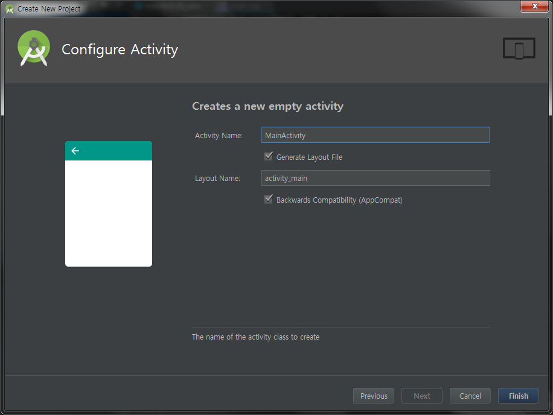

# Android 에서 OpenCV 사용

#### Download

- [Android Studio](https://developer.android.com/studio/)

- [OpenCV](https://github.com/opencv/opencv/releases)

- [opencv-3.4.2-android-sdk](https://github.com/opencv/opencv/releases/download/3.4.2/opencv-3.4.2-android-sdk.zip)

#### Install

- Create New Project




- Import OpenCV


- app module **build.gradle**, openCVLibrary342 module **build.gradle** 의 SdkVersion을 같도록 변경


- Module dependency


- style theme 내용 추가

```
<!-- No Title Bar-->
<item name="windowActionBar">false</item>
<item name="windowNoTitle">true</item>
```

- 최상위 layout에 JavaCameraView 추가

```
<org.opencv.android.JavaCameraView
	android:layout_width="match_parent"
	android:layout_height="match_parent"
	android:id="@+id/javaCameraView" />
```

- Android Manifest 수정

  * permission 추가
  
  ```
<uses-permission android:name="android.permission.CAMERA"/>
<uses-feature android:name="android.hardware.camera" android:required="false"/>
<uses-feature android:name="android.hardware.camera.autofocus" android:required="false"/>
<uses-feature android:name="android.hardware.camera.front" android:required="false"/>
<uses-feature android:name="android.hardware.camera.front.autofocus"  android:required="false"/>
  ```

  * screen size
  
  ```
<supports-screens android:resizeable="true"
	android:smallScreens="true"
	android:normalScreens="true"
	android:largeScreens="true"
	android:anyDensity="true" />
  ```
  
  * activity 속성에 추가
  
  ```
android:screenOrientation="landscape"
android:configChanges="keyboardHidden|orientation"
  ```

- 자바 코드에서 선언한 네이티브 메소드에 대응하는 C/C++ 함수가 선언되어 있는 헤더 파일을 jni 디렉토리에 자동으로 생성

- File > Settings > Tools > External Tools > + > Create Tools

  * Name : javah
  
  * Description : Android Tool - javah
 
  * Tool Settings > Program : C:\JetBrains\Android Studio\jre\bin\javah.exe (javah 경로)
  
  * Tool Settings > Arguments : -v -jni -d $ModuleFileDir$/src/main/jni $FileClass$
  
  * Tool Settings > Working directory : $SourcepathEntry$
  
  * Advanced Options > Make console active on message in stdout > checked
  
  * Advanced Options > Make console active on message in stderr > checked


- MainAcitivity 에 native 함수 추가 및 Library load

```
public native void opencv_lib_run(long matAddrInput, long matAddrResult);

static {
	System.loadLibrary("opencv_java3");
	System.loadLibrary("native-lib");
}
```

- MainActivity.java 오른쪽 버튼 누른 후 External Tools > javah 실행

```
"C:\JetBrains\Android Studio\jre\bin\javah.exe" -v -jni -d D:\ANDROID\MyApplication\app/src/main/jni com.yellowdo.myapplication.MainActivity
[Creating file RegularFileObject[D:\ANDROID\MyApplication\app\src\main\jni\com_yellowdo_myapplication_MainActivity.h]]

Process finished with exit code 0
```

- 생성된 헤더 폴더인 jni 폴더에서 main.cpp 파일을 생성 후 아래와 같이 내용 추가함

```
#include <jni.h>
#include "com_yellowdo_myapplication_MainActivity.h"

#include <opencv2/opencv.hpp>
using namespace cv;

extern "C" {

JNIEXPORT void JNICALL Java_com_yellowdo_myapplication_MainActivity_opencv_1lib_1run
    (JNIEnv *env, jobject instance, jlong matAddrInput, jlong matAddrResult){

    Mat &matInput = *(Mat *)matAddrInput;
    Mat &matResult = *(Mat *)matAddrResult;

    cvtColor(matInput, matResult, CV_RGBA2GRAY);
    Canny(matResult, matResult, 120, 200, 3);
}

}
```

- ndk-build 사용하여 공유 라이브러리(.so)를 빌드하기 위해서는 Android.mk 파일과 Application.mk 파일을 작성

  * Android.mk (OPENCVROOT는 현재 사용자의 OpenCV-android-sdk 폴더의 위치로 변경해줘야함)
  
  ```
LOCAL_PATH := $(call my-dir)
include $(CLEAR_VARS)

#opencv library
OPENCVROOT:= C:\Android\OpenCV-android-sdk
OPENCV_CAMERA_MODULES:=on
OPENCV_INSTALL_MODULES:=on
OPENCV_LIB_TYPE:=SHARED
include ${OPENCVROOT}\sdk\native\jni\OpenCV.mk


LOCAL_MODULE    := native-lib
LOCAL_SRC_FILES := main.cpp
LOCAL_LDLIBS += -llog

include $(BUILD_SHARED_LIBRARY)
  ```

  * Application.mk (APP_PLATFORM App의 SDK 플랫폼 버전과 같아야함
  
  ```
APP_OPTIM := debug
APP_ABI := all
APP_PLATFORM := android-28

APP_STL := gnustl_static
APP_CPPFLAGS := -frtti -fexceptions
NDK_TOOLCHAIN_VERSION := clang

APP_BUILD_SCRIPT := Android.mk
  ```

- app Module 내용에 externalNativeBuild 추가 (android 내용 안에)

```
externalNativeBuild {
	ndkBuild {
		path 'src/main/jni/Android.mk'
	}
}
```

- MainAcitivity에 implements CameraBridgeViewBase.CvCameraViewListener2

  * 상속된 CvCameraViewListener2 인터페이스 함수를 구현 (Implement 단축키 : Ctlr + I)
  
  ```
private Mat matInput, matResult;

@Override
    public void onCameraViewStarted(int width, int height) {
        
    }

    @Override
    public void onCameraViewStopped() {

    }

    @Override
    public Mat onCameraFrame(CameraBridgeViewBase.CvCameraViewFrame inputFrame) {
        matInput = inputFrame.rgba();
        if ( matResult == null )
            matResult = new Mat(matInput.rows(), matInput.cols(), matInput.type());

        opencv_lib_run(matInput.getNativeObjAddr(), matResult.getNativeObjAddr());
        return matResult;
    }
  ```

- BaseLoaderCallback 인터페이스 구현

```
private BaseLoaderCallback mLoaderCallback = new BaseLoaderCallback(this) {
	@Override
	public void onManagerConnected(int status) {
		super.onManagerConnected(status);
		switch (status) {
			case LoaderCallbackInterface.SUCCESS:
				mOpenCvCameraView.enableView();
				break;
		}
	}
};
```

- Activity LifeCycle에 맞게 OpenCvCameraView를 Init

  * onCreate
  
  ```
private CameraBridgeViewBase mOpenCvCameraView;

@Override
protected void onCreate(Bundle savedInstanceState) {
	super.onCreate(savedInstanceState);
	setContentView(R.layout.activity_main);

	getWindow().setFlags(WindowManager.LayoutParams.FLAG_FULLSCREEN, WindowManager.LayoutParams.FLAG_FULLSCREEN);
	getWindow().setFlags(WindowManager.LayoutParams.FLAG_KEEP_SCREEN_ON, WindowManager.LayoutParams.FLAG_KEEP_SCREEN_ON);

	if (Build.VERSION.SDK_INT >= Build.VERSION_CODES.M) {
		//퍼미션 상태 확인
		if (!hasPermissions(PERMISSIONS)) {
			//퍼미션 허가 안되어있다면 사용자에게 요청
			requestPermissions(PERMISSIONS, PERMISSIONS_REQUEST_CODE);
		}
	}

	mOpenCvCameraView = (CameraBridgeViewBase) findViewById(R.id.javaCameraView);
	mOpenCvCameraView.setVisibility(SurfaceView.VISIBLE);
	mOpenCvCameraView.setCvCameraViewListener(this);
	mOpenCvCameraView.setCameraIndex(0); // front-camera(1),  back-camera(0)
	mLoaderCallback.onManagerConnected(LoaderCallbackInterface.SUCCESS);
}
  ```

  * onPause (Override 단축키 : Ctrl + O)

  ```
 @Override
protected void onPause() {
	super.onPause();
	if (mOpenCvCameraView != null)
		mOpenCvCameraView.disableView();
}
  ```

  * onResume

  ```
 @Override
protected void onResume() {
	super.onResume();
	if (!OpenCVLoader.initDebug()) {
		OpenCVLoader.initAsync(OpenCVLoader.OPENCV_VERSION, this, mLoaderCallback);
	} else {
		mLoaderCallback.onManagerConnected(LoaderCallbackInterface.SUCCESS);
	}
}
  ```

  * onDestroy

  ```
 @Override
protected void onDestroy() {
	super.onDestroy();
	if (mOpenCvCameraView != null)
		mOpenCvCameraView.disableView();
}
  ```

- Permission 내용 추가 (카메라 권한이 요구됨)

```
static final int PERMISSIONS_REQUEST_CODE = 1000;
String[] PERMISSIONS = {"android.permission.CAMERA"};

private boolean hasPermissions(String[] permissions) {
	int result;
	for (String perms : permissions) {
		result = ContextCompat.checkSelfPermission(this, perms);
		if (result == PackageManager.PERMISSION_DENIED) {
			//허가 안된 퍼미션 발견
			return false;
		}
	}
	//모든 퍼미션이 허가되었음
	return true;
}

@Override
public void onRequestPermissionsResult(int requestCode, @NonNull String[] permissions, @NonNull int[] grantResults) {
	super.onRequestPermissionsResult(requestCode, permissions, grantResults);
	switch (requestCode) {
		case PERMISSIONS_REQUEST_CODE:
			if (grantResults.length > 0) {
				boolean cameraPermissionAccepted = grantResults[0] == PackageManager.PERMISSION_GRANTED;
				if (!cameraPermissionAccepted)
					showDialogForPermission("앱을 실행하려면 퍼미션을 허가하셔야합니다.");
			}
			break;
	}
}

@TargetApi(Build.VERSION_CODES.M)
private void showDialogForPermission(String msg) {
	AlertDialog.Builder builder = new AlertDialog.Builder(MainActivity.this);
	builder.setTitle("알림");
	builder.setMessage(msg);
	builder.setCancelable(false);
	builder.setPositiveButton("예", new DialogInterface.OnClickListener() {
		public void onClick(DialogInterface dialog, int id) {
			requestPermissions(PERMISSIONS, PERMISSIONS_REQUEST_CODE);
		}
	});
	builder.setNegativeButton("아니오", new DialogInterface.OnClickListener() {
		public void onClick(DialogInterface arg0, int arg1) {
			finish();
		}
	});
	builder.create().show();
}
```

- Build 하여 확인 / OpenCV Canny 적용된 것을 확인
  
