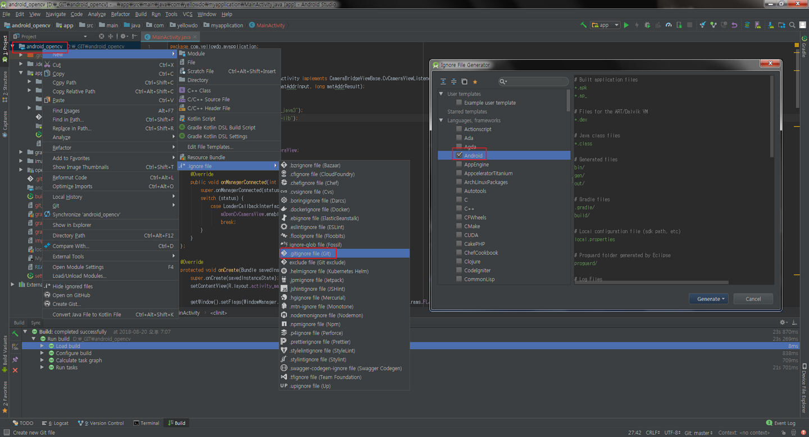

# Android Studio 에서 Git 제외 목록 자동 생성된

#### .ignore 설치

- File > Settings > Plugins > Browse repositories > **.ignore ** 설치

- Restart

- Project 마우스 오른쪽버튼 > New > .ignore file > .gitignore file (Git)

- Ignore File Generator > Languagues, framework > Android > Generator

- 출저 http://menukanows.com/how-to-add-gitignore-file-in-android-project/